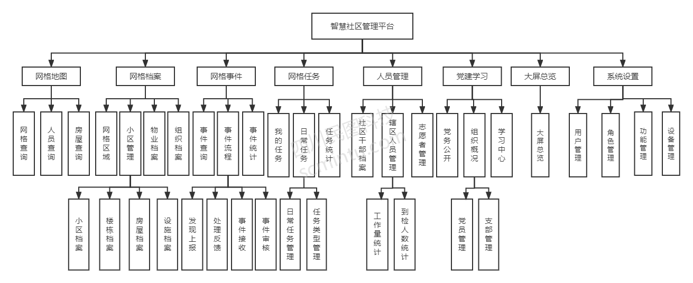
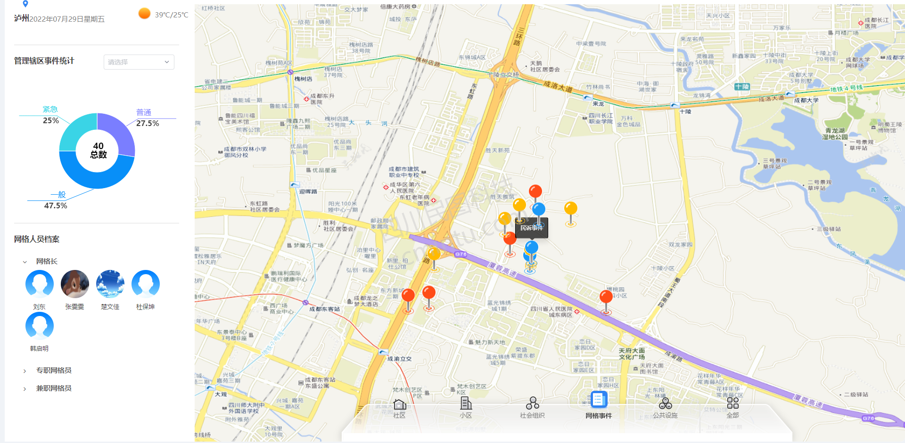
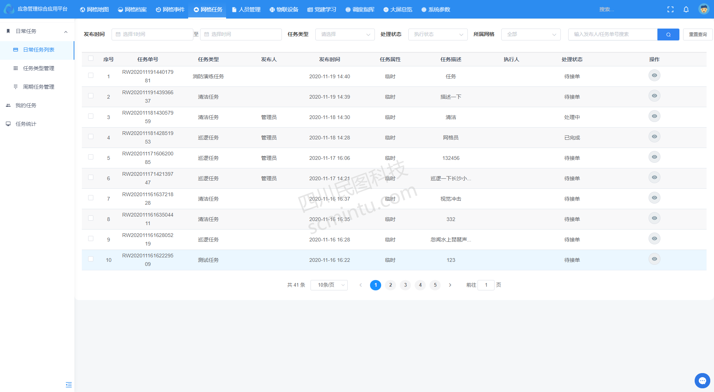
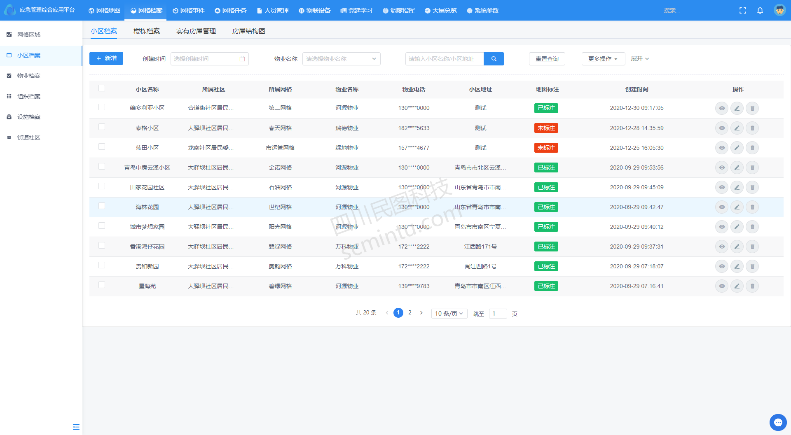

<p align="center">
	<a href="hhttp://223.87.166.240:8014"></a>
</p>
<p align="center">
	<strong>适合互联网企业使用的开源智慧社区管理平台</strong>
</p>
<p align="center">
	👉 <a href="http://223.87.166.240:9123">https://scmtww.gnway.cc</a> 👈
</p>

<p align="center">
	<a target="_blank" href="https://spring.io/projects/spring-boot">
		
	</a>
    <a target="_blank" href="https://www.oracle.com/java/technologies/javase/javase-jdk8-downloads.html">
		
	</a>
	<a target="_blank" href="http://www.gnu.org/licenses/lgpl.html">
		
	</a>
</p>


-------------------------------------------------------------------------------

## 📚 项目介绍

SmartCommunity是一套适合互联网企业使用的开源智慧社区管理平台，是充分利用移动互联网信息技术的集成应用，以家庭为中心、结合社区、商家等服务主体，将物业服务、社区服务等整合在一个高效的系统之中。让市民轻松享受安全、便捷、精彩、健康、幸福的智慧生活，本项目为后端工程。

前端工程项目代码：https://gitee.com/scmt1/SmartCommunityUI


## 🍎 项目特点

* 可以管理社区各种各样的数据
* 以家庭为中心、结合社区、商家等服务主体，将物业服务、社区服务等整合在一个高效的系统
* 可以对接各个社区管理设备，便于社区管理
* 使用`spring boot`框架作为后端框架，便于维护
* 接口请求和响应数据采用签名机制，保证交易安全可靠
* 管理平台操作界面简洁、易用
* 使用`spring security`实现权限管理
* 前后端分离架构，方便二次开发

## 🍟 项目体验
- 智慧社区管理平台：[http://223.87.166.240:8014](http://223.87.166.240:8014 "智慧社区管理平台")

## 🥞 系统架构

> 智慧社区管理平台架构图


> 核心技术栈

| 软件名称  | 描述 | 版本
|---|---|---
|Jdk | Java环境 | 1.8
|Spring Boot | 开发框架 | 2.4.5
|Redis | 分布式缓存 | 3.2.8 或 高版本
|MySQL | 数据库 | 5.7.X 或 8.0 高版本
|[Iview Ui](http://iview.talkingdata.com/) | iview Vue框架，前端开发使用 | 4.7.0
|[MyBatis-Plus](https://mp.baomidou.com/) | MyBatis增强工具 | 3.4.2
|[Hutool](https://www.hutool.cn/) | Java工具类库 | 5.6.6

> 项目结构

```lua
SmartCommunityUI  -- https://gitee.com/scmt1/SmartCommunityUI.git

SmartCommunity
├──scmt-magic-api -- 封装的magic-api
├──scmt-system -- 公共配置 启动项目包
├──scmt-ywgl -- 通用业务依赖包
├──scmt-zhsq -- 智慧社区应用依赖包
└── vx_images -- 项目截图
```


## 🍿 功能模块

> 智慧社区管理平台功能


## 🍯 系统截图

`以下截图是从实际已完成功能界面截取,截图时间为：2022-07-29 08:59`




## 🥪 关于我们
***
* 公司名称：四川民图科技有限公司
* 地址：成都市金牛区北三环路一段221号
* 电话：0830-2663368
* 业务 QQ：1544857622
* 业务合作：scmtkj@163.com
* 微信：dj18428385268

## 🥪 交流群
如果需要体验账号请加QQ群


